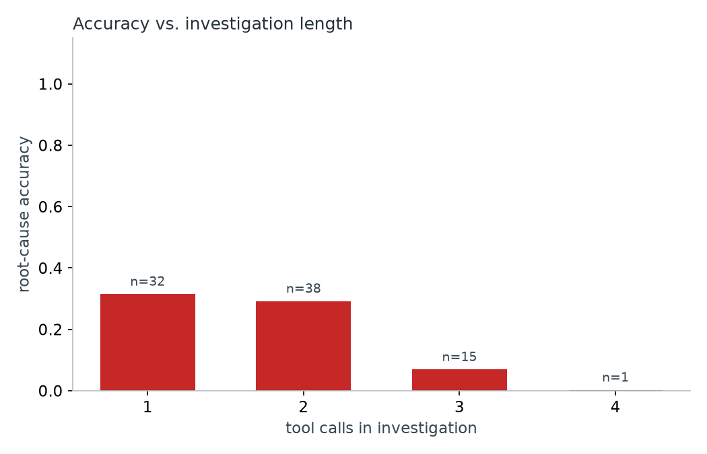

# CellTrace

An agentic root-cause investigator for cellular (5G) network signaling failures.
A local LLM agent is handed a reported symptom (session id, timestamp, one-line
description), queries RRC/NAS/PHY log layers as tools -- deciding which layer to
check next based on what it's already seen -- and produces a root-cause claim
with verbatim-cited log lines. A harness then checks whether the root cause was
actually right and whether every citation is real.

**Everything in this repo runs locally.** No paid APIs, no cloud accounts, no
logins, no real subscriber data anywhere.

## Network-stack decision

This build uses a **hand-written, protocol-accurate log synthesizer**, not a
live UERANSIM+Open5GS deployment. **No log in this repository comes from a live
network -- every timestamp, message, and signal-quality value is synthetic.**

This was a deliberate call, made explicit before writing any code: Open5GS's
~10-microservice 5G core plus UERANSIM's UE/gNB simulator need a TUN device and
`NET_ADMIN` inside Docker, are historically flaky on macOS Docker Desktop, and
risked burning an entire build session on container networking before any of
the actual point of this project -- the C++ parser, the agent, the eval harness
-- got built. The synthesizer is cross-checked message-by-message against the
public 3GPP specs **38.331** (5G NR RRC) and **24.501** (5G NAS): every field
name in every message is the real information-element name from those specs.
Full schema and fault-type-to-mechanism mapping is in [DESIGN.md](DESIGN.md).

## Fault types

10 distinct, protocol-level fault types, each injected 6-10 times across
different simulated UEs/cells/sessions with timing jitter, for **86 total
labeled failure incidents** (plus 30 fault-free sessions generated alongside
them so the log stream isn't just back-to-back failures):

| fault_type | layer(s) | mechanism |
|---|---|---|
| `AUTH_BAD_KEY` | NAS | bad shared key -> AuthenticationReject (MAC-failure) |
| `REG_TIMEOUT_DROPPED_NAS` | NAS | RegistrationAccept dropped in transit -> T3510 timeout, retry |
| `RRC_CONN_FAIL_CONGESTION` | RRC | RRCSetupRequest -> RRCReject (congestion) |
| `HO_MISSED_MEASUREMENT` | RRC+PHY | RSRP crosses handover threshold, MeasurementReport never sent |
| `HANDOVER_RECONFIG_TIMEOUT` | RRC | handover command sent, RRCReconfigurationComplete never arrives (t304 expiry) |
| `PHY_SIGNAL_RLF` | PHY+RRC | RSRP/SINR degrade past out-of-sync thresholds, no compensating handover |
| `SECURITY_MODE_FAILURE` | NAS | stale key context post-handover -> SecurityModeReject |
| `SERVICE_REQUEST_NO_CONTEXT` | NAS | AMF already dropped UE context -> ServiceReject (no-context) |
| `PAGING_TIMEOUT` | RRC | Paging sent, no RRCSetupRequest response before timer expiry |
| `DEREGISTRATION_IMPLICIT` | NAS | missed periodic registration -> AMF-internal implicit deregistration |

See [DESIGN.md](DESIGN.md) for the full mechanism description and the shared
log-format contract every component below reads and writes.

## Architecture

```
synthesizer/  -> data/logs/{rrc,nas,phy}.jsonl + data/incidents.jsonl (ground truth)
                          |
                          v
parser/ (C++)     ring buffer -> parse -> LogStore   (pybind11: celltrace_parser)
                          |
                          v
agent/ (Python)   Ollama tool-calling loop over LogStore + rag/ corpus
                          |
                          v
eval/             root-cause accuracy, citation-grounding verifier, tool-use stats
```

## C++ parser

Not a wrapper around a Python log reader -- the actual parsing and structuring
happens in C++, exposed to Python as a pybind11 native extension
(`celltrace_parser`), so Python only ever consumes already-structured dicts.

- **`json.hpp`/`json.cpp`**: a small hand-written recursive-descent JSON parser
  (no third-party JSON library). Builds a real `json::Value` tree (move-only,
  `unique_ptr`-indirected Object/Array so the recursive type is safe to define),
  not a string Python would have to re-parse.
- **`ring_buffer.hpp`**: a lock-free SPSC ring buffer (atomics, cache-line-padded
  head/tail to avoid false sharing), capacity rounded to a power of two.
- **`log_store.cpp`**: three independent producer/consumer pipelines (one per
  log file) run concurrently -- a producer thread reads lines into the ring
  buffer, a consumer thread parses them out the other side -- then all three
  per-layer stores are sorted by timestamp once ingestion completes, so
  out-of-order arrival (real logs aren't always delivered in order) doesn't
  break windowed queries.
- **Unit tests** (Catch2, 35 test cases): valid parsing, malformed JSON
  (truncated objects/arrays/strings, bad literals, unescaped control
  characters, trailing garbage), missing/wrong-typed envelope fields, a
  file-based integration test through the real threaded ingestion pipeline
  against a fixture file with malformed lines mixed into valid ones, and a
  concurrent producer/consumer ordering stress test that pushes 200,000 items
  through the ring buffer and individually checks each one arrived, in order,
  exactly once. That stress test alone accounts for 200,001 of the suite's
  200,101 total Catch2 assertions -- the other 34 test cases contribute the
  remaining ~100, which is the more normal number to compare against
  hand-written correctness checks. **Clean under AddressSanitizer +
  UndefinedBehaviorSanitizer.**

**Throughput** (synthetic benchmark, `parser/benchmarks/bench_throughput.cpp`,
Release build, Apple M-series):

| total messages | wall time (s) | messages/sec |
|---:|---:|---:|
| 150,000 | 0.093 | 1,619,132 |
| 600,000 | 0.354 | 1,692,921 |
| 1,500,000 | 0.949 | 1,581,398 |

On the actual generated dataset for this project (16,489 real log lines across
all three layers) ingestion is dominated by thread-startup and file-I/O
overhead rather than parse cost, since the dataset is small: ~55K msgs/sec
end-to-end from Python via the pybind11 bridge. The number above is the
sustained parse-pipeline throughput at a scale where startup cost stops
mattering.

## RAG layer

25 hand-authored, postmortem/runbook-style entries in
[`rag/corpus.json`](rag/corpus.json) (2 per fault type + 5 general triage/cause-code
entries), embedded locally with `sentence-transformers/all-MiniLM-L6-v2` (no
API calls, no login). Retrieval is brute-force cosine similarity over a 25x384
matrix (`rag/retriever.py`) -- at this corpus size a FAISS index would be pure
overhead.

## Agent

`agent/investigator.py` runs an Ollama tool-calling loop (`qwen2.5:3b-instruct`,
local) with four tools (`get_rrc_window`, `get_nas_window`, `get_phy_window`,
`rag_lookup`) plus a required `submit_root_cause` tool that structures the
final answer (fault type, explanation, and a list of `{layer, ts, quoted_text}`
citations) so it's never free text with no traceable evidence. The agent picks
its own window sizes and which layer to check next -- it isn't forced through
a fixed tool order. If it exhausts its step budget without submitting, one
final call restricted to only the submit tool forces a best-guess answer
rather than silently timing out.

### Example transcript

A correctly-solved, real, non-cherry-picked-for-difficulty investigation
(`INC_0008`, full transcript in `eval_results/transcripts.jsonl`):

> **Incident**: session `sess_00008`, reported_ts=3058.6, symptom: *"registration
> never completed, UE stuck retrying"*

1. **Tool call**: `get_rrc_window(3043.6, 3063.6)` -> empty result.
2. **Reasoning**: *"It seems that no RRC messages were found in the provided
   window. Let's expand the window slightly."*
3. **Tool call**: `get_rrc_window(3040.6, 3065.6)` -> RRCSetupRequest/Setup/
   SetupComplete found.
4. **Reasoning**: *"...Given the symptom 'registration never completed, UE
   stuck retrying,' it seems the UE might be stuck in a retry loop after the
   RRCSetupComplete message. Let's check the NAS layer."*
5. **Tool call**: `get_nas_window(3040.6, 3065.6)` -> shows authentication and
   security mode succeeding, then **two** RegistrationRequests with no
   RegistrationAccept between them.
6. **Reasoning**: *"...the UE is retrying the registration without completing
   successfully... Let's use rag_lookup to search for relevant failure
   patterns."*
7. **Tool call**: `rag_lookup("UE stuck retrying registration, NAS layer")` ->
   retrieves the `REG_TIMEOUT_DROPPED_NAS-1` corpus entry.
8. **Final answer**: `fault_type=REG_TIMEOUT_DROPPED_NAS`, citing the second
   RegistrationRequest verbatim (`ts=3058.559`, `layer=NAS`) -- **correct**,
   and the citation verifies clean against the real log.

This is the adaptive, cross-tool behavior the spec asked for: it didn't call
all four tools in a fixed order, it widened a window after an empty result,
switched layers based on what RRC actually showed, and only reached for RAG
once it had a concrete pattern to match against.

## Evaluation

Run: `python -m eval.run_eval` (or `make eval` / `make docker-eval`). Every one
of the 86 labeled incidents is run through a fresh investigation against the
real `LogStore`, using the real local model -- no shortcuts, no mocked tools.

**Current numbers (post diagnose-then-fix pass, detailed below): overall
root-cause accuracy 25.6%, citation hallucination rate 58.1% (86/86
incidents, `qwen2.5:3b-instruct`).** The very first run before that pass
scored 24.4% / 75.6% -- both are reported, and the full story of what
changed and why is in "Diagnose-then-fix pass" further down. Reported
honestly, per fault type, because it isn't one blended number worth hiding
behind:

| fault_type | n | correct | accuracy |
|---|---:|---:|---:|
| AUTH_BAD_KEY | 6 | 6 | 100.0% |
| RRC_CONN_FAIL_CONGESTION | 10 | 7 | 70.0% |
| SERVICE_REQUEST_NO_CONTEXT | 10 | 3 | 30.0% |
| PHY_SIGNAL_RLF | 8 | 2 | 25.0% |
| HANDOVER_RECONFIG_TIMEOUT | 10 | 2 | 20.0% |
| DEREGISTRATION_IMPLICIT | 7 | 1 | 14.3% |
| SECURITY_MODE_FAILURE | 8 | 1 | 12.5% |
| HO_MISSED_MEASUREMENT | 7 | 0 | 0.0% |
| PAGING_TIMEOUT | 10 | 0 | 0.0% |
| REG_TIMEOUT_DROPPED_NAS | 10 | 0 | 0.0% |

The split is still not random, though the pattern shifted after the fix (see
below for why). **The agent is now excellent on fault types resolved from a
single explicit signal in one layer** (`AUTH_BAD_KEY`: 100%,
`RRC_CONN_FAIL_CONGESTION`: 70%) and **still fails on fault types whose
signature is the *absence* of an expected message, or a pattern that only
shows up after correlating a time gap against a specific timer duration**
(`HO_MISSED_MEASUREMENT`, `PAGING_TIMEOUT`, `REG_TIMEOUT_DROPPED_NAS`, all at
0%). `qwen2.5:3b-instruct` is a small, local, 3-billion-parameter model, and
Part 3 of the diagnose-then-fix pass below tests directly whether that's
actually why the 0%-accuracy group stays at 0%.

**Citation grounding: 58.1% of investigations contain at least one fabricated
or misquoted citation** (down from 75.6% before the fix -- see below).
Breaking down what's left: a mix of the agent still submitting zero
citations alongside a guess (which this harness counts as ungrounded,
correctly, since a claim with no evidence isn't grounded regardless of
whether the guess happened to be right) and genuinely invented evidence --
notably timestamps that look like Unix epoch values (`1583930304.021`)
instead of this project's simulation-clock seconds, a pattern documented in
LEARNING.md. (An earlier version of this verifier also flagged citations
that quoted a real field value in readable prose, e.g. `"-107.6 dBm"` for
`{"rsrp_dbm": -107.6}`, as fabricated purely because it wasn't a verbatim
JSON substring -- that was a bug in the *checker*, not the agent, fixed by
also matching on real field values/numbers with rounding tolerance. All
numbers in this README are post that fix.)

**Tool-use efficiency**: average 1.83 tool calls per investigation (median
2, down from 3.85/3 before the fix -- see below for why). Investigations at
or below the median scored 30.0% accuracy; investigations above it scored
6.25%. Same direction as before the fix: more tool calls here still tracks
"this case was hard" rather than "the agent successfully dug deeper," though
both numbers dropped alongside the overall drop in investigation depth
discussed below.



### How citation grounding is checked

`eval/verify_citations.py` re-queries the *same* `LogStore` the agent's tools
used for the exact `(layer, ts, session_id)` in each citation. A citation
passes if the quoted text is a verbatim substring of the real log line, OR
references the real `msg_type`, OR its content semantically matches the
message's actual field values (string field values, or numbers within
rounding tolerance) -- the agent is allowed to quote a value in prose
("-107.6 dBm") rather than exact JSON syntax. It fails if no message exists
at that layer/ts/session at all, or if one does but nothing in the quote
matches its real content. This means a "hallucination" here is the agent
misquoting its own tool output (or citing nothing), not a discrepancy between
the parser and some other source of truth.

### Diagnose-then-fix pass

The first full run scored 24.4% accuracy / 75.6% citation hallucination.
Rather than guess at a fix, every ungrounded investigation's raw transcript
was read and classified before changing any code:

| category (of 65 ungrounded investigations) | count | share |
|---|---:|---:|
| Answered but never invoked -- a correct, fully-formed answer written as prose, `submit_root_cause` never actually called | 27 | 42% |
| Incomplete -- still mid-investigation when the step budget ran out | 21 | 32% |
| Fabricated/misquoted -- a real tool call, but the citation genuinely doesn't match | 14 | 22% |
| True abstention / one-off cases (wrong-layer label on real content, absence-of-evidence forced into the citation schema) | 3 | 4% |

**74% of ungrounded investigations were a format/completion problem, not a
reasoning problem** -- confirmed by spot-checking 6 of the 0%-accuracy
cross-layer cases: the agent reached the correct layer(s) in every one of
them, it just failed to land a structured final answer. Full transcripts,
concrete examples, and the invented-Unix-epoch-timestamp pattern found in the
genuine-fabrication cases are in [LEARNING.md](LEARNING.md).

Fix: evidence-gathering still uses native tool-calling (it worked reliably),
but the final answer is now produced by a dedicated call using Ollama's
JSON-schema-constrained structured output instead of a native
`submit_root_cause` tool call, with an explicit `insufficient_evidence`
boolean kept separate from `fault_type` so a genuine "I don't know" is a
valid, honest, scoreable answer rather than indistinguishable from a bad
guess (`agent/investigator.py`).

**Before / after, full 86-incident re-run:**

| metric | before | after | delta |
|---|---:|---:|---:|
| Overall accuracy | 24.4% | 25.6% | +1.2pp |
| Citation hallucination rate | 75.6% | 58.1% | **-17.5pp** |
| Avg tool calls / investigation | 3.85 | 1.83 | -2.02 |

| fault_type | before | after | delta |
|---|---:|---:|---:|
| AUTH_BAD_KEY | 33.3% | 100.0% | **+66.7pp** |
| HANDOVER_RECONFIG_TIMEOUT | 0.0% | 20.0% | +20.0pp |
| RRC_CONN_FAIL_CONGESTION | 60.0% | 70.0% | +10.0pp |
| HO_MISSED_MEASUREMENT | 0.0% | 0.0% | +0.0pp |
| PAGING_TIMEOUT | 0.0% | 0.0% | +0.0pp |
| REG_TIMEOUT_DROPPED_NAS | 10.0% | 0.0% | -10.0pp |
| PHY_SIGNAL_RLF | 37.5% | 25.0% | -12.5pp |
| SECURITY_MODE_FAILURE | 25.0% | 12.5% | -12.5pp |
| DEREGISTRATION_IMPLICIT | 28.6% | 14.3% | -14.3pp |
| SERVICE_REQUEST_NO_CONTEXT | 50.0% | 30.0% | -20.0pp |

**Citation grounding improved substantially and overall accuracy moved only
slightly, because the fix traded investigation depth for completion
reliability.** Average tool calls per investigation dropped from 3.85 to
1.83 -- the new flow finalizes as soon as the model stops issuing tool calls
instead of nudging it to keep going, so a shallow, quick-to-resolve fault
type wins big (`AUTH_BAD_KEY`: 33.3% -> 100.0%, its whole signature is one
NAS exchange) while fault types that benefited from a longer, multi-layer
dig got shallower and lost ground (`SERVICE_REQUEST_NO_CONTEXT`: 50.0% ->
30.0%; `REG_TIMEOUT_DROPPED_NAS`: 10.0% -> 0.0%). `HANDOVER_RECONFIG_TIMEOUT`
went from completely unsolved to 20% -- the format fix alone was enough to
recover some real, previously-unreachable answers. The two fault types
requiring the hardest absence-of-evidence + cross-layer correlation
(`HO_MISSED_MEASUREMENT`, `PAGING_TIMEOUT`) stayed at 0% -- this is exactly
Part 3's question.

One more real, positive number the old design couldn't produce at all: **20
of 86 investigations now honestly set `insufficient_evidence: true`** instead
of silently guessing "OTHER" -- a genuine, machine-checkable "I don't know"
that the harness can now tell apart from a wrong guess, which is what Part
2 was actually supposed to add on top of the raw accuracy/hallucination
numbers.

**Larger local model on the cross-layer gap:**

Re-ran the same agent logic, unchanged, pointed at `qwen2.5:7b-instruct`
(more than double the parameters) instead of `qwen2.5:3b-instruct`, on just
the 27 incidents from the three still-0%-accuracy fault types
(`HO_MISSED_MEASUREMENT`, `PAGING_TIMEOUT`, `REG_TIMEOUT_DROPPED_NAS`):

| metric | 3B model | 7B model |
|---|---:|---:|
| Accuracy on this 27-incident subset | 0/27 (0.0%) | 0/27 (0.0%) |
| Citation hallucination rate | 85.2% (23/27) | 85.2% (23/27) -- identical count |
| Avg tool calls / investigation | 2.30 | 3.93 |

**The bigger model did not help at all -- 0% both times, and the exact same
23/27 investigations produced an ungrounded citation, not just a similar
rate.** It wasn't for lack of effort: the 7B model made 71% more tool calls
on average (3.93 vs 2.30), genuinely investigating more before answering. It
still couldn't crack this subset. This is a real, useful negative result: it
argues the gap here isn't raw model capacity, it's something about how these
three fault types' evidence is structured (an *absence* of an expected
message, or a pattern that only becomes visible by explicitly comparing a
gap against a specific timer duration) that neither model size handles with
the current tool set and prompting -- closing it would need a different kind
of scaffolding (e.g. a tool that explicitly answers "was message X missing
between t1 and t2", instead of expecting the model to notice an absence on
its own from a list of what *did* happen), not a bigger model.

## Responsible data handling

Simulated UEs carry a SUPI-like synthetic identifier (`imsi_sim_*`) that
**never touches disk or the LLM prompt**. Before any log line is written,
`synthesizer/anonymize.py` replaces it with `ue_<8 hex chars>` = the first 8
hex characters of an HMAC-SHA256 of the raw id, keyed with a key that exists
only in memory during generation. The same real UE always maps to the same
pseudonym (so cross-layer/cross-session correlation still works), but the
mapping is one-way and irreversible from the output alone.

**Not anonymized, deliberately**: `session_id` and `cell_id` are not treated as
sensitive (they don't identify a subscriber) and are left as-is for
readability. This is control-plane signaling only -- there's no IMEI,
location beyond coarse cell_id, or user-plane payload data anywhere in this
system, so subscriber identifiers are the only thing that needed this
treatment.

## Running it

```bash
# local, no docker
make venv
make data           # generates data/logs/*.jsonl + data/incidents.jsonl
make parser-build    # builds the pybind11 extension
make parser-test     # Catch2 tests under ASan+UBSan
make parser-bench    # throughput benchmark
make eval            # runs the full agent eval (needs `ollama pull qwen2.5:3b-instruct`)

# docker compose (ollama + agent, model auto-pulled on first run)
make data            # data/ is bind-mounted into the container, generate it first
make docker-eval
```

## Repo layout

```
DESIGN.md              shared contract: log schema, fault mechanisms, anonymization, bridge design
synthesizer/            5G RRC/NAS message builders, fault injectors, generator, anonymizer
parser/                 C++ streaming parser + pybind11 bridge + Catch2 tests + benchmark
rag/                    hand-authored failure-pattern corpus + retriever
agent/                  tool definitions + Ollama tool-calling investigator loop
eval/                   citation verifier, eval runner, report/chart generation
tests/                  Python unit tests (synthesizer, citation verifier)
docker-compose.yml, docker/  containerized bring-up
.github/workflows/ci.yml     C++ tests (ASan+UBSan) + Python tests on every push
LEARNING.md             protocol/systems notes written for the author, not the reader
```
